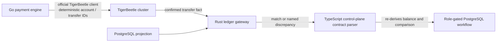

# TigerBeetle activation and stakeholder onboarding

## Purpose and authority split

UmojaFlowOS uses **two complementary records**, not competing ledgers. TigerBeetle is the authoritative accounting engine for a confirmed double-entry transfer after its cluster has been activated. PostgreSQL is the authoritative control-plane record for payment lifecycle, counterparties, customer and beneficiary records, KYC/KYB evidence, approvals, compliance cases, reporting, and the local projection of the confirmed transfer fact.

> A TigerBeetle `created` response is an accounting fact. It is **not** by itself a customer-visible settlement, regulatory submission, or permission to advance a payment order.

| Concern | Authoritative system | Why |
| --- | --- | --- |
| Double-entry account and transfer fact | TigerBeetle | Atomic debit/credit semantics, history-enabled accounts, deterministic transfer identifiers. |
| Business workflow and compliance controls | PostgreSQL | Role-gated lifecycle, evidence, approvals, audit trail, regulatory workflow, and operator UI. |
| Agreement control | Rust ledger gateway and TypeScript contract parser | Independently re-derive posting balance and compare the TigerBeetle fact with its PostgreSQL projection. |

## TigerBeetle cluster provisioning

The deployment starting point is `infra/tigerbeetle/tigerbeetle.env.template`. It remains disabled until an authorised operator deploys a quorum-backed cluster, provisions its replica data using the supported TigerBeetle format workflow, and exposes a private authenticated encrypted TCP boundary.

| Step | Operator action | Fail-closed outcome if absent or invalid |
| --- | --- | --- |
| 1. Allocate cluster | Select a non-zero cluster ID and deploy the approved TigerBeetle quorum. | The Go process will not construct a client. |
| 2. Protect transport | Place the native TCP protocol behind an mTLS/service-mesh proxy; retain `UMOJA_TIGERBEETLE_TLS_REQUIRED=true`. | Remote plaintext is refused by configuration validation. |
| 3. Allocate accounting ledgers | Assign separate non-zero ledger numbers for NGN, KES, and ZAR. | The Go runtime rejects missing currency coverage before network activity. |
| 4. Allocate semantic codes | Assign non-zero account and transfer codes through the accounting-control registry. | The Go runtime refuses startup. |
| 5. Configure privately | Supply addresses and settings through deployment configuration, never browser input, source code, or a record-table credential field. | Partial enabled configuration exits at startup; it does not fall back to an inactive client. |
| 6. Reachability and activation | Start the Go engine; it performs a bounded TCP preflight, then constructs the official TigerBeetle client. | An unreachable endpoint exits startup within the configured preflight limit. |
| 7. Reconcile | Post deterministic account and transfer IDs, obtain the confirmed fact through the approved operational path, and compare it with PostgreSQL through Rust. | A mismatch or incomplete side becomes an explicit discrepancy. |

The Go composition point is `internal/ledger/runtime_config.go`. `RuntimeFromProcessEnv()` returns a `DisabledClient` only when the feature is explicitly disabled. If `UMOJA_TIGERBEETLE_ENABLED=true`, it requires the complete cluster, ledger, and code configuration; malformed values, missing NGN/KES/ZAR ledgers, non-loopback plaintext, and an unreachable address stop service startup. The official client adapter in `internal/ledger/tigerbeetle.go` accepts only `created` or exact idempotent `exists` results for accounts and transfers. A client deadline after a call is **indeterminate** and must be retried with the same deterministic ID.

## Rust verification and reconciliation gateway

The Rust service is intentionally a **verifier, not a poster**. `services/ledger-gateway/src/main.rs` exposes three relevant routes:

| Route | Input | Independent control | Result |
| --- | --- | --- | --- |
| `POST /v1/postings/validate` | Proposed debit/credit postings | Recalculates the net per currency and rejects malformed entries. | Balanced result or an NGN/KES/ZAR discrepancy. |
| `POST /v1/projections/reconcile` | Confirmed TigerBeetle fact plus PostgreSQL projection | Compares transfer ID, correlation ID, currency, amount, and required timestamps. | Reconciled or a named `INCOMPLETE_*`/`MISMATCH` discrepancy. |
| `POST /events/payment-order-validated` | Validated immutable payment event | Validates event identity, topic, type, version, and execution boundary. | Event accepted only for a disabled projection path until the ledger deployment is activated. |

The gateway has no TigerBeetle client and no database client. That prevents it from turning its own assessment into a mutation. Its versioned response carries the facts it judged, and the TypeScript parser recomputes both the posting net and fact/projection comparison; the control plane therefore does not trust a single implementation’s `balanced` or `reconciled` flag.

## Stakeholder onboarding model

The overview page now presents a role-aware **workspace** for the four internal platform stakeholders. It is driven only by recorded signals from the same overview counters shown elsewhere in the console; it does not award progress from optimistic UI state or inferred readiness.

| Stakeholder | Guided sequence | Explicit boundary |
| --- | --- | --- |
| Administrator | Register regulated counterparty → register connection → name deployment secret through the protected administrator control → review operating posture. | Registering a connection does not activate a provider. |
| Compliance officer | Create evidence subject → record verification consent → store authorised document → review evidence/case → prepare reportable follow-up. | Analysis is evidence-only; no automated KYC/KYB outcome is produced. |
| Treasury operator | Record reconciled liquidity → review market evidence → draft payment order → inspect authorised legs and controls. | A draft, rate lock, or recommendation never moves funds. |
| Auditor | Review operating posture → inspect service observations → inspect payment/treasury records → inspect compliance/reporting evidence. | The role is read-only and cannot approve, configure, or decide. |

External counterparties, regulators, and customers do **not** receive a self-service console role. Their involvement is represented by administrator-recorded legal identity, licence evidence, consent, provider connection, verified submission reference, and attributable review. That avoids fabricating an unauthorised external account or giving a counterparty operational authority inside the platform.

The UI is implemented in `StakeholderOnboardingWorkspace.tsx`. Every “Open” control only navigates to the already role-gated module; it does not invoke a state-changing action. DOM regressions cover all four internal roles, role absence, signal-derived progress, navigation, evidence-only compliance language, and non-executing treasury/admin boundaries.
